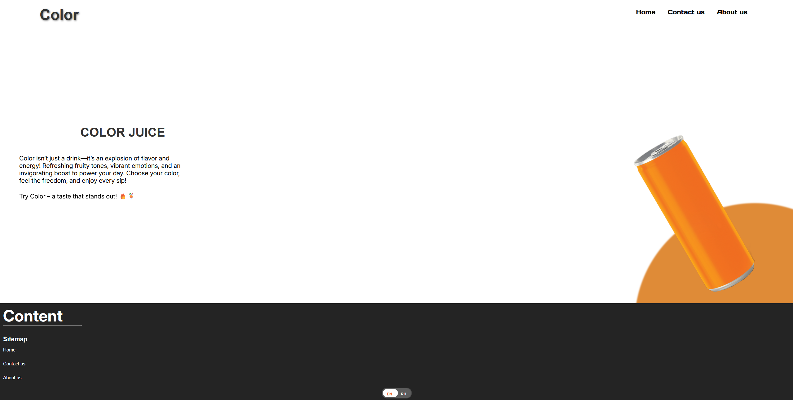

# Color Website

A simple web project to show a produt.

## Installation

1. **Clone the repository:**
    ```bash
    git clone https://github.com/your-username/Color-Website.git
    cd Color-Website/Colors
    ```

2. **Install dependencies:**
    ```bash
    npm install
    ```

3. **Start the development server:**
    ```bash
    npm start
    ```

4. Open your browser and go to `http://localhost:3000`

## Website design


